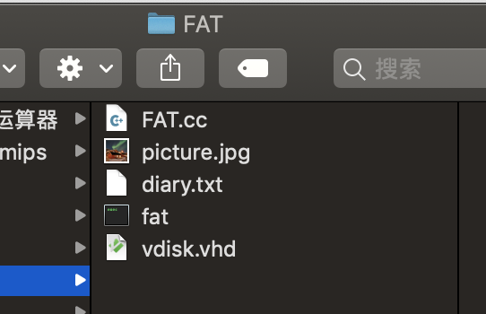
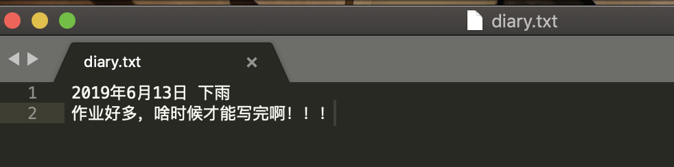
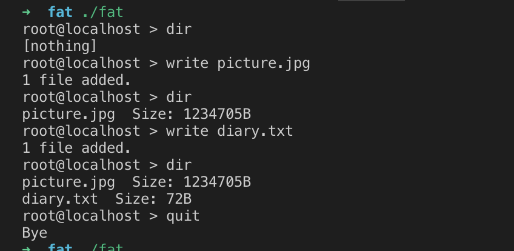
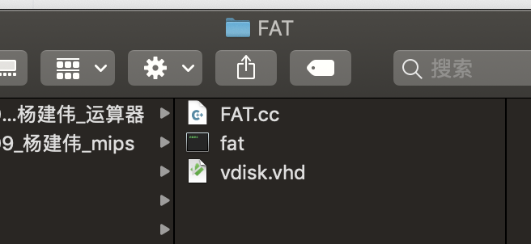
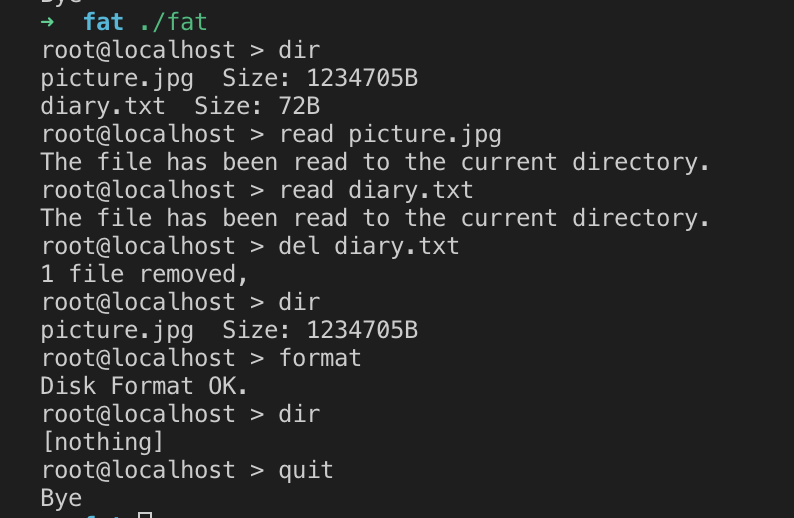

# FAT磁盘模拟

```
姓名：杨建伟
学号：3170101209
```

## 一、问题描述

编写程序模拟磁盘工作。以大文件模拟磁盘，建立FAT、文件目录等数据结构，进行列目录、文件增加删除等操作，实现文件操作命令：dir、copy、del。 

可考虑子目录操作：md(建子目录)、cd(转子目录) 

读写VHD虚拟磁盘只能整块(簇)读写，每次能且只能读写一个块(簇)。所以基础的VHD读写可编写以下函数： 

```c
int clusterRead(byte&, int); //int为簇号 
int clusterWrite(byte*, int);
```

##二、实现原理

### 2.1 磁盘原理

硬盘由很多盘片(platter)组成，每个盘片的每个面都有一个读写磁头。每个盘片被划分成若干个同心圆磁道，每个盘片的划分规则通常是一样的。这样每个盘片的半径均为固定值R的同心圆再逻辑上形成了一个以电机主轴为轴的柱面(Cylinders)，从外至里编号，每个盘片上的每个磁道又被划分为几十个扇区(Sector)，通常的容量是512byte，并按照一定规则编号为1、2、3……形成 Cylinders×Heads×Sector个扇区。

## 2.2 FAT文件系统

FAT文件系统将硬盘分为**MBR区、DBR区、FAT区、FDT区、DATA区**等5个区域，并以簇管理磁盘

### 2.2.1 MBR

第一个扇区叫做MBR。主引导记录（MBR，Main Boot Record）是位于磁盘最前边的一段引导代码，这段代码用于启动操作系统。如果磁盘仅用于存储数据，那么MBR就没有意义。

MBR中还包含GPT，其全称叫做GUID磁盘分区表（GUID Partition Table，缩写：GPT）其含义为“全局唯一标识磁盘分区表”，是一个实体硬盘的分区表的结构布局的标准。

### 2.2.2 DBR

DBR（Dos Boot Record）分区引导记录，是每个FAT分区的第一个扇区。有些只有一个分区的磁盘，第一个扇区也可以是DBR扇区。

DBR扇区中存储了当前FAT文件系统的绝大部分信息，如FAT表个数，FAT表起始扇区号，根目录的起始簇号等等。

### 2.2.3 FAT

FAT表是FAT文件系统在磁盘上划分出来的一块区域，用于指示一个文件的各个部分存放在何处。其中一个FAT表项对应DATA区的一个簇。一个文件FAT表项中填写的下一个FAT表项的地址，这样的一个链表就能指示出了整个文件存储的所有区域。

下表是FAT单元取值的含义


### 2.2.4 FDT

FDT（File Directory Table）表即为文件目录表，也称为根目录区或ROOT区FDT位于第二个FAT表之后，当FAT表不能定位文件在硬盘中的位置时，FAT需和FDT配合以便能准确定位文件的位置。

也就是说，FDT中存储的就是一个个的文件目录项，目录项包含文件、文件夹。文件目录项中存储的是文件名，文件起始簇号，文件长度等基本信息，文件具体内容在DATA区

文件目录项的具体定义如下：


### 2.2.5 DATA

实际储存数据的空间

##三、算法原理

### 3.1 列出文件目录

#### 3.1.1 算法描述

遍历FDT的每个扇区，在每个扇区中寻找有效的文件信息，之后打印出来。

#### 3.1.2 伪代码

```c
for each sector in FDT
	for each record in sector
		if record is vaild then
			print(record)
```

### 3.2 向磁盘写文件

#### 3.2.1 算法描述

先查找文件是否存在，如果存在，就删除原文件。

在FDT中寻找合适的位置用于保存新的文件的目录项，写入目录项。

在FAT表中寻找空闲扇区保存文件数据，一个扇区写满之后，再寻找下一个空闲扇区，并把上一个扇区的FAT表中的项更新。

#### 3.2.2 伪代码

```c
for each sector in FDT
	for each record in sector
		if(record.name = filename)
      deleteFDT(filename)
for each sector in FDT
	for each record in sector
		if(record is empty)
      writeFDT(fileInfo)
      break
int sectorID = getEmptySector()
while(file is not EOF)
  writeData(file)
  if(getStatusSector(sectorID) == FULL)
    nextSector = getEmptySector()
    setFATNextSector(sectorID, nextSector)
    sectorID = nextSector
```

### 3.3 从磁盘读文件

#### 3.3.1 算法描述

首先从FDT表中搜索，查找到该文件的第一个扇区。

然后从第一个扇区读起，每次读完一个扇区，在FAT表中得到下一个扇区的位置，循环至读到最后一个扇区为止。

#### 3.3.2 伪代码

```c
int sectorID = getSectorIdInFDT(fileName)
bool isOver = false
while(!isOver) {
  readSector(sectorID)
  sectorID = getNextSecotrIdInFAT(sectorID)
  if(sectorID == -1)
    isOver = true
}
```

### 3.4 删除磁盘中文件

#### 3.4.1 算法描述

首先删除FDT表中的记录，也就是把记录变为0

然后按照FAT表，依次把每个扇区的信息变为0

#### 3.4.2 伪代码

```c
for each sector in FDT
	for each record in sector
		if record.name == filename
			sectorID = record.sectorID
			record = 0
      break
while(sectorID != -1)
  nextSectorID = getNextSectorIdInFAT(sectorID)
  FAT[sectorID] = 0
  sectorID = nextSectorID
```

##四、编译方法

1. 直接编译运行FAT.cc
2. 使用make命令

##五、使用方法

```
Options:	
	dir : 列出磁盘下的所有文件名和文件大小
	write [filename] : 将文件写入虚拟磁盘
	read [filename] : 将文件从虚拟磁盘内读出
	del [filename] : 删除虚拟磁盘内的文件
	format : 格式化虚拟磁盘
	quit : 退出程序
```

## 六、运行情况

程序目录下的文件：



diary.txt的内容



picture.jpg:


运行程序，将这两个文件加入虚拟磁盘



然后将这两个文件删除



再次运行程序，把这两个文件从虚拟磁盘中读出来，同时测试了虚拟磁盘的删除和格式化



读出后的文件目录：


diary.txt 内容：


picture.png 内容


与原文件完全一致

## 七、总结

这次大程动手实现了一个简单的FAT文件系统，FAT文件系统使用簇管理磁盘，为了管理簇，加入了FAT表，为了管理文件，加入了FDT表。做完这次大程，对FAT文件系统的理解更加深入了，知道了自己的电脑是如何管理磁盘的，熟悉了FAT的基本结构，也对二进制文件的随机读写更加熟练了。